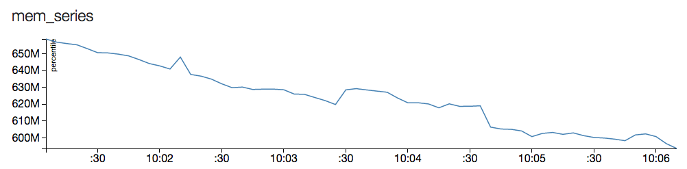

# timeseries-samples

A few samples of time-series data management using [influxdb](http://influxdb.com/). The included `mock.js` generates second-resolution percentage data for CPU Utilization and Free Memory.



## a few example queries

Simple select of all value

`select * from mem_series;`

Select of values based on time

`select sample_value from cpu_series where time > '2013-08-12 23:32:01.232'`

95th percentile of value in 5 second intervals

`select percentile(sample_value, 95) from mem_series group by time(5s);`

Standard deviation of value in 5 second intervals

`select stddev(sample_value) from cpu_series group by time(1m);`

InfluxDB also supports additional aggregate functions:

```count(), min(), max(), mean(), mode(), median(), distinct(), percentile(), histogram(), derivative(), sum(), stddev(), first(), last()```
